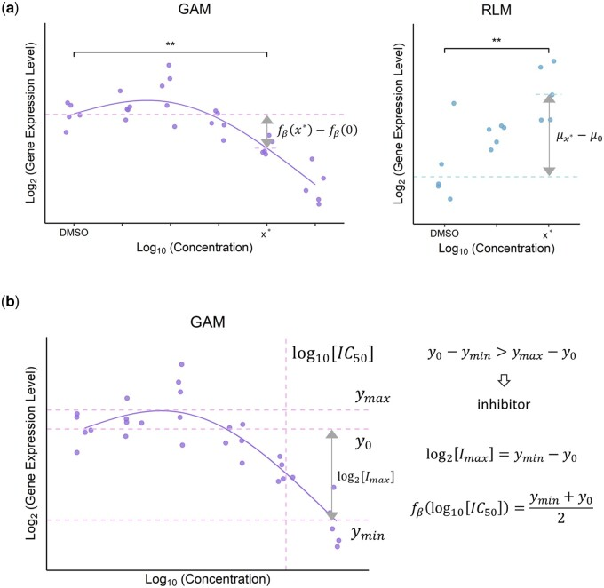
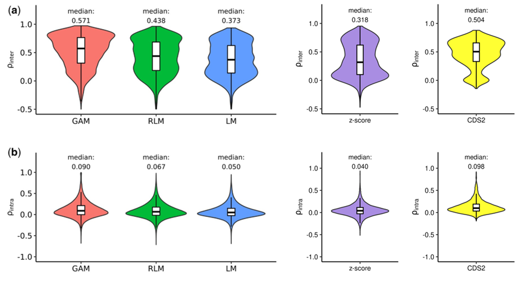
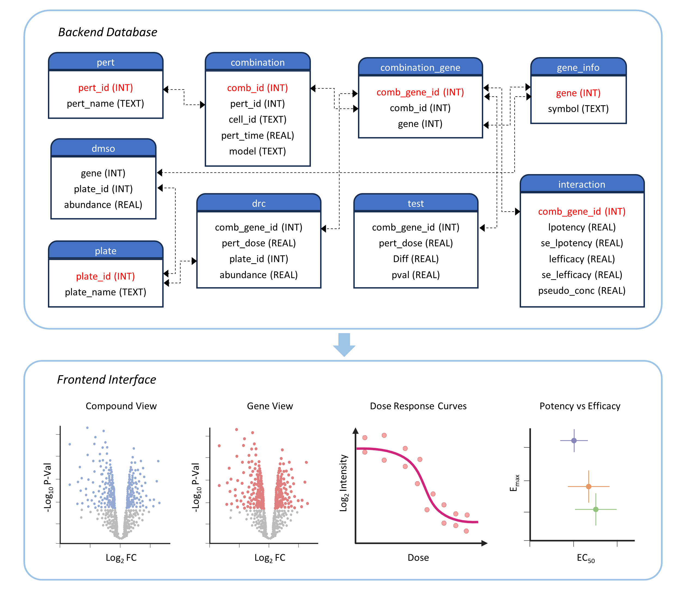

DOSE-L1000
================
Junmin Wang
12/18/2024

This page aims to present DOSE-L1000 in an accessible way for a broad 
audience. For those interested in implementing GAMs or rebuilding the 
DOSE-L1000 database, detailed prerequisites and code descriptions are 
provided at the bottom of this page.

## Introduction

The LINCS L1000 project has the transcriptional profiles for
thousands of compounds across a wide array of concentrations, cell
lines, and time points. However, conventional analysis methods (i.e., 
moderated z-scores, characteristic direction method) often fall short 
in capturing the rich information encapsulated within the L1000 
dose-response data.

We present DOSE-L1000, a database that unravels the intricate landscape
of compound-induced transcriptional changes and compound-gene
interactions. By fitting over <strong>140 million</strong> generalized additive models (GAM)
and robust linear models encompassing the entire LINCS L1000 database,
our work provides quantitative insights into differential gene
expression and the potency and efficacy of compound-gene pairs across
diverse cellular contexts (Wang et al., 2023; https://pmc.ncbi.nlm.nih.gov/articles/PMC10663987/) (Fig. 1).

  

 

**Fig. 1.** Illustration of a model-based approach for unveiling gene expression signatures, efficacy, and potency. (a) Schematic overview of model fitting and differential expression analysis. (b) Definitions of potency and efficacy.

## Features

Our GAM-based approach leverages the dose-response trend to offer two key advantages:

- It enables the calculation of <strong>potency and efficacy</strong>, 
along with their standard errors, something traditional methods cannot provide (Fig. 1b).
- It provides more <strong>robust</strong> estimates of log2 
fold changes compared to linear models, robust linear models, moderated z-scores 
(Subramanian et al., 2017), and the characteristic direction method (Duan et al., 2016) 
(Fig. 2). GAM produces the most similar log2 fold changes under the same 
perturbation condition across batches among them all.

  

**Fig. 2.** Distribution of pairwise (a) inter-batch and (b) intra-batch Pearson correlation coefficients of model-derived log2 fold changes. Inter-batch correlation refers to the similarity of log2 fold changes across batches under the same perturbation condition, whereas intra-batch correlation, the similarity of log2 fold changes across perturbation conditions within the same batch. GAM, RLM, LM, z-score, and CDS2 stand for generalized additive model, robust linear model, linear model, moderated z-score, and the characteristic direction method, respectively.

## How to Use DOSE-L1000

I have developed DOSE-L1000-Viz, a Shiny app that enables users to explore 
compound-induced gene expression changes, as well as the efficacy and 
potency of compound-gene pairs. This app offers an interactive platform 
for visualization and analysis, accessible at https://www.dosel1000.com.

With this app, you can:

- Generate compound-level volcano plots.
- Create gene-level volcano plots.
- Visualize dose-response data.
- Compare efficacy and potency across compounds, genes, or cell lines (Fig. 3).

  

**Fig. 3.** Overview of the backend database and frontend interface of DOSE-L1000-Viz.

## Prerequisites

- The original LINCS L1000 data are required to generate the DOSE-L1000 
database. The complete list of required files is provided in Supplementary 
Table 1 of our DOSE-L1000 paper in *Bioinformatics* (see References).

- The DOSE-L1000 database is required to reproduce the plots and analysis 
in our DOSE-L1000 paper and can be downloaded from https://doi.org/10.5281/zenodo.8286375. 
All required R packages to run the scripts are listed in the header of each file. 

## Code Descriptions
<table>
  <thead>
    <tr>
      <th>Purpose</th>
      <th>Folder</th>
      <th>File name</th>
      <th>Description</th>
    </tr>
  </thead>
  <tbody>
    <tr>
      <td rowspan="6">
        
Database Generation

      </td>
      <td rowspan="2">
        
model/

      </td>
      <td>main_GSE92742.R main_GSE70138.R</td>
      <td>differential expression analysis for all combinations of compounds, cell lines, and genes</td>
    </tr>
    <tr>
      <td>main_lx50_GSE92742.R main_lx50_GSE70138.R</td>
      <td>characterizing the efficacy and potency of compound-gene pairs for all combinations of compounds, cell lines, and genes</td>
    </tr>
    <tr>
      <td rowspan="4">
        
funs/

      </td>
      <td>get.gam.tests.R get.rlm.tests.R get.lm.tests.R</td>
      <td>t-tests to compare the mean responses for GAMs, robust linear models, and linear models</td>
    </tr>
    <tr>
      <td>get.gam.stats.R</td>
      <td>calculating the estimates and standard errors of potency and efficacy via delta method</td>
    </tr>
    <tr>
      <td>get.gamer.log2fc.R get.rlmer.log2fc.R</td>
      <td>estimating log2 fold change for mixed GAMs and robust linear models with random effects</td>
    </tr>
    <tr>
      <td>get.gam.stats.boot.R</td>
      <td>calculating the estimates and standard errors of efficacy and potency via bootstrapping</td>
    </tr>
    <tr>
      <td rowspan="3">
        
Plotting

      </td>
      <td rowspan="3">
        
plot/

      </td>
      <td>plot_volcano.R</td>
      <td>volcano plots in Figure 3a of our DOSE-L1000 paper</td>
    </tr>
    <tr>
      <td>plot_potency_vs_efficacy.R</td>
      <td>scatter plots in Figures 3b and 3c of our DOSE-L1000 paper</td>
    </tr>
    <tr>
      <td>plot_heatmap.R</td>
      <td>heat map in Figure 4 of our DOSE-L1000 paper</td>
    </tr>
    <tr>
      <td>Normality Assumption</td>
      <td>normal_dist/</td>
      <td>check_norm_assump_GSE92742.R check_norm_assump_GSE70138.R</td>
      <td>calculating the Pearson correlation coefficients from Q-Q plots for all combinations of compounds, cell lines, and time</td>
    </tr>
    <tr>
      <td rowspan="4">
        
Inter- and Intra-Batch Correlations

      </td>
      <td rowspan="4">
        
robust/

      </td>
      <td>find_common_cpd_cell_pairs.R</td>
      <td>finding repeated compound-cell line-batch combinations</td>
    </tr>
    <tr>
      <td>fit_all_models_GSE92742.R fit_all_models_GSE70138.R</td>
      <td>fitting GAMs, robust linear models, and linear models, and running differential expression analysis for all repeated combinations of compounds and cell lines</td>
    </tr>
    <tr>
      <td>calc_sd_log2fc.R</td>
      <td>calculating standard deviation of log2 fold changes for all repeated perturbation conditions</td>
    </tr>
    <tr>
      <td>calc_inter_batch_corr.R calc_intra_batch_corr.R</td>
      <td>calculating pairwise inter- and intra-batch Pearson correlation coefficients</td>
    </tr>
    <tr>
      <td rowspan="2">
        
Plate Effects

      </td>
      <td rowspan="2">
        
plate/

      </td>
      <td>fit_mixed_model_GSE92742.R fit_mixed_model_GSE70138.R</td>
      <td>fitting mixed models and estimating log2 fold change for all combinations of compounds and cell lines</td>
    </tr>
    <tr>
      <td>compare_fixed_vs_mixed.R</td>
      <td>calculating the Pearson correlation between the results of fixed effect-only models and mixed models</td>
    </tr>
    <tr>
      <td>Delta Method vs Bootstrapping</td>
      <td>delta_vs_bootstrap/</td>
      <td>compare_delta_vs_boot.R</td>
      <td>comparing the delta method against bootstrapping</td>
    </tr>
    <tr>
      <td rowspan="2">
        
Predictions of Drug-Target Interactions

      </td>
      <td rowspan="2">
        
LOOCV/

      </td>
      <td>find_HDACi_DTC.R</td>
      <td>retrieving HDAC inhibitors from Drug Target Commons</td>
    </tr>
    <tr>
      <td>LOOCV_HDACi.R</td>
      <td>building a classifier for HDAC inhibitors and running leave-one-out cross-validation (LOOCV) on the classifier</td>
    </tr>
  </tbody>
</table>

 Note: GSE92742 and GSE70138 are the accession codes of phase 1 and phase 2 LINCS projects, respectively.

## Contribute

We welcome your feedback and contributions! If you have suggestions, 
find an issue, or want to add new features, feel free to open an issue or 
submit a pull request. Together, we can make this project even better!

## References

- Wang J, Novick S. DOSE-L1000: unveiling the intricate landscape of compound-induced transcriptional changes. *Bioinformatics*. 2023 Nov 1;39(11): btad683. 
- Subramanian A et al. A Next Generation Connectivity Map: L1000 Platform and the First 1,000,000 Profiles. 
*Cell*. 2017 Nov 30;171(6): 1437-1452.e17.
- Duan Q et al. L1000CDS2: LINCS L1000 characteristic direction signatures search engine. 
*NPJ Syst Biol Appl*. 2016;2:16015.
